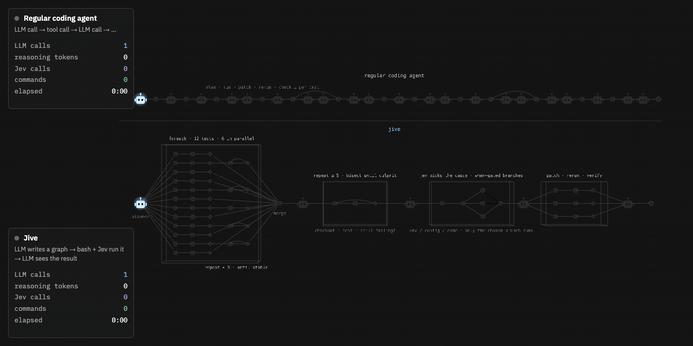
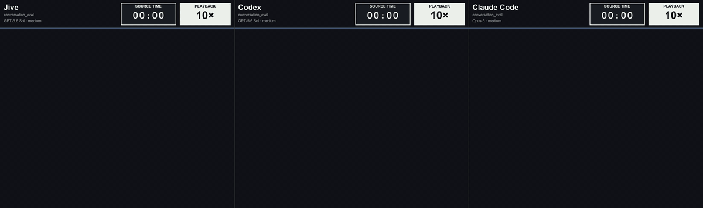

# Jive

> Rethinking the Agentic Loop with System One Models

I have been thinking that the current Agentic Loop design of LLM Call -> Tool Call -> ... has been outdated. The arrival of Jev and other System One models provided us a primitive we desperately needed. We need an agent that can natively think fast and slow. Not have workflows or multi-agent architectures that mimics it.

The agent should be able to do its hard reasoning using the power of modern LLMs, capture an execution graph filled with steps and fast intuitive decisions, and prevent it from making LLM calls for just to "follow through the plan". 



**Jive** replaces "Tool Calls" with "Graph Calls", where each graph is a DAG-based workflow compromising of Tool Calls and Jev Calls. The agent can do bulk evaluation / analysis of datasets, multi-step profiling, repetitive tasks very efficiently with System One decisions sprinkled in between. 

## Install

```sh
curl -fsSL https://raw.githubusercontent.com/merijjeyn/jive/main/install.sh | sh
```

## Benchmark results



| Task | Agent | Time | Tool calls | LLM calls | Jev calls | Output tokens | Demo |
|---|---|---|---|---|---|---|---|
| `conversation_eval` | **Jive** | 3m 26s | 128 | 16 | 50 | 11,070 | [video](demos/edits/Jive%20vs%20Codex%20vs%20Claude%20-%20conversation_eval.mp4) |
|  | Codex | 29m 33s | 59 | 60 | 0 | 20,467 |  |
|  | Claude Code | 16m 48s | 97 | 98 | 0 | 47,899 |  |
| `error_handling_audit` | **Jive** | 3m 10s | 43 | 10 | 0 | 10,656 | [video](demos/edits/Jive%20vs%20Codex%20vs%20Claude%20-%20error_handling_audit.mp4) |
|  | Codex | 19m 29s | 49 | 50 | 0 | 25,774 |  |
|  | Claude Code | 5m 08s | 53 | 54 | 0 | 42,508 |  |
| `product_matching` | **Jive** | 3m 03s | 299 | 9 | 140 | 8,921 | [video](demos/edits/Jive%20vs%20Codex%20vs%20Claude%20-%20product_matching.mp4) |
|  | Codex | 22m 00s | 47 | 48 | 0 | 19,742 |  |
|  | Claude Code | 32m 02s | 21 | 23 | 0 | 19,345 |  |
| `search_latency` | **Jive** | 2m 00s | 13 | 8 | 0 | 9,568 | [video](demos/edits/Jive%20vs%20Codex%20vs%20Claude%20-%20search_latency.mp4) |
|  | Codex | 9m 00s | 17 | 18 | 0 | 12,793 |  |
|  | Claude Code | 7m 18s | 36 | 37 | 0 | 51,356 |  |
| `sembench_movie` | **Jive** | 1m 47s | 255 | 10 | 120 | 6,114 | [video](demos/edits/Jive%20vs%20Codex%20vs%20Claude%20-%20sembench_movie.mp4) |
|  | Codex | 19m 58s | 41 | 42 | 0 | 10,334 |  |
|  | Claude Code | 8m 51s | 13 | 14 | 0 | 15,723 |  |
| `slow_trace_search` | **Jive** | 1m 41s | 12 | 7 | 0 | 5,719 | [video](demos/edits/Jive%20vs%20Codex%20vs%20Claude%20-%20slow_trace_search.mp4) |
|  | Codex | 6m 00s | 10 | 11 | 0 | 8,064 |  |
|  | Claude Code | 3m 04s | 21 | 22 | 0 | 19,253 |  |

As you can see, we are much better in terms of speed and token efficiency compared to Codex and Claude Code, even on tasks that doesn't require Jev calls. 

-------

It is generally not a good idea to fight against a models training, and there are certain tasks that codex, claude code or your favorite agent is better for. **BUT:**
- I argue it is already extremely useful in certain usecases, and surprisingly more efficient with on par quality on most daily tasks of an engineer.
- There is a direct corrolation with the intelligence index of a model, and how effectively it can utilize jive. As the models get better, and System One Models get better, and we slowly get into the training set, the gap will be undeniable
- It is a great core to improve e2e latency and cost for a lot of enterprise usecases like customer support, targeted assistants for lawyers, internal analytics agents etc. without compromising on quality. 

So screw it, I'm fighting the models training. 

**Let's welcome "Agent 2.0"**

I know its a bold statement. I'm not sure if this is it. But I know its a step in the right direction.

## Principles
- **Carrying the torch lit by pi coding agent**: Minimal agent scaffold, customizable but great defaults, no MCP, no Agents, etc. clis are enough. See [pi.dev](https://pi.dev/)
- Works well with all **system one** and **system two models**. Evolves with new model capabilities. 
- **Lightweight**: Cache efficient, token-efficient agent interfaces, eager execution, low resources, etc. 
- Graphs should remain flexible and as a **"higher level programming layer" for the agent**, not managing fixed workflows. 
- Always open source and free.


## Documentation

- [Overview and getting started](docs/README.md): what Jive is, installation, quick start, project configuration, command line, development
- [Using Jive](docs/USAGE.md): interface, sessions, headless commands, skills, extractors
- [Graph contract](docs/GRAPH_CONTRACT.md): the graph language the planner writes
- [Planner context](docs/CONTEXT.md): planner context, compaction, and Jev input limits
- [Design](DESIGN.md): architecture and confirmed design decisions
- [Taskground](taskground/README.md), and the [planner evaluation guide](evals/planner/README.md)


- [Contributing](CONTRIBUTING.md)
  - You can test jive on certain tasks easily using the taskground. If you do, please contribute your task to the repo so we can build a shared open-source dataset together. 

## License

[MIT](LICENSE)
